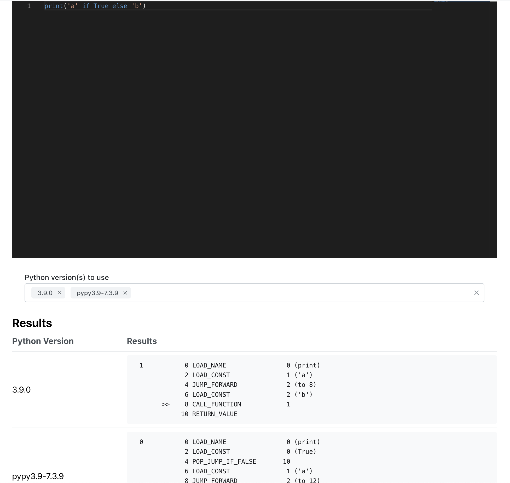

# Python Byte Code Explorer

Server:  

A simple prototype app for exploring Python bytecode instructions.
Check Python bytecode instructions for a single version or across different versions.

## Usage

The application is Docker-based, so you need Docker.

- Build the image from the 'server' directory: `docker build -t pbce .`
- Run the container from that image: `docker run --rm -d -p 8080:8080 pbce`
- Run the client in the `client` directory: `npm run start`
- The client is running at `http://localhost:3000`
